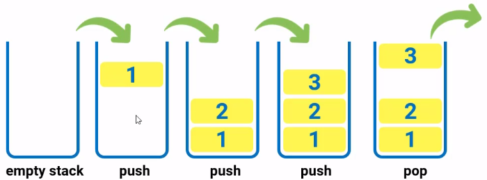
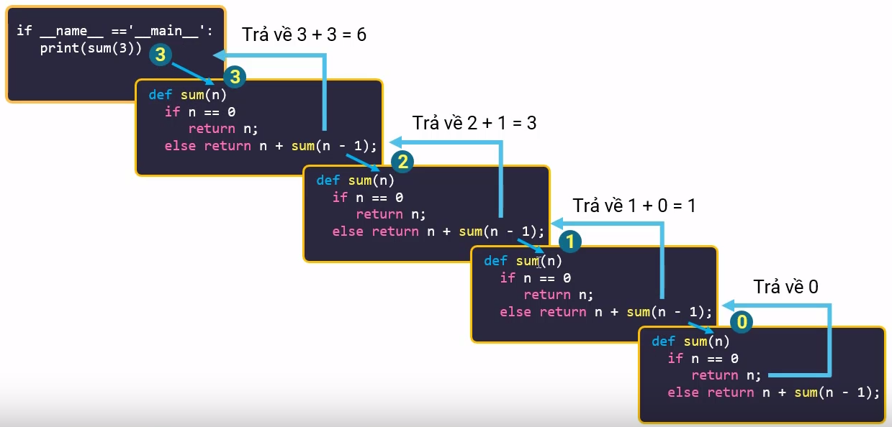

# BÀI 46: KỸ THUẬT ĐỆ QUY

## 1. CẤU TRÚC DỮ LIỆU NGĂN XẾP

- Ngăn xếp (`stack`) là một cấu trúc dữ liệu có quan hệ mật thiết với cơ chế hoạt động của đệ quy. Để hiểu được cách hàm đệ quy hoặt động, ta cần nắm được cách hoạt động của cấu trúc dữ liệu ngăn xếp.

- Ngăn xếp là một cấu trúc dữ liệu hỗ trợ 2 thao tác là `push` và `pop`. Trong đó `push` giúp thêm 1 phần tử vào đỉnh của ngăn xếp, `pop` giúp xoá 1 phần tử khỏi đỉnh ngăn xếp. cả 2 thao tác này đều được thực hiện ở đỉnh ngăn xếp.

- Ngăn xếp hoặt động theo nguyên tắ viết tắt là FILO (Last In First Out) nghĩa là vào cuối thì ra đầu. Các phần tử vào cuối cùng sẽ ra đầu tiên.

    

- Trong chương trình tồn tại một bộ nhứo là ngăn xếp, cách hoặt động của bộ nhứo này tương tự như cách hoạt động của cấu trúc dữ liệu ngăn xếp.

## 2. Stackframe là gì?

- `Stack frame` là một kĩ thuật quản lý bộ nhớ xuất hiện trong một số ngôn ngữ lập trình, nó có nhiệm vụ tạo ra và loại bỏ các biến tạm thời.

- Có thể hiểu `stack frame` là một tập hợp tất cả các thông tin liên quan đến một chương trình con (được tạo ra khi xuất hiện lời gọi hàm).

- `Stack frame` chỉ tồn tại trong quá trình chương trình thực thi, `stack frame` giúp các ngôn ngữ lập trình hộ trợ được chức năng đệ quy cho chương trình con.

- Những thành phần của `stack frame` có thể kể đến như biến cục bộ, đối số, địa chỉ trả về một chương trình con.

- Mỗi khi một lời gọi hàm được thực hiện, `stack frame` chứa thông tin của hàm đó được đẩy vào bộ nhứo stack và khi hàm đó kết thức thì `stack frame` này được loại bọ khỏi bộ nhớ stack.

- Ví dụ:

    ```python
    def A():
        print("A")

    def B():
        A()
        print("B")

    if __name__ == "__main__":
        B()
    ```

    ```python
    # kết quả
    A
    B
    ```

- Giải thích, khi gọi hàm `B()` thì `B()` được đẩy vào trong bộ nhớ `stack`, thực hiện hàm `B()` thì gọi hàm A() thì đẩy `A()` vào bộ nhớ `stack` (tức là `A()` rồi mới đến `B()`). Vậy thực hiện hàm `A()` thì đẩy hàm `A()` ra khỏi bộ nhớ `stack`, rùi thực hiến hàm `B()` rùi đẩy `B()` ra khỏi `stack`.

## 3. Hàm đệ quy

- Hàm đệ quy: là hàm gọi lại chính nó.

- Ví dụ (ví dụ về tổng n số đầu tiên)

    ```python
    def S(n):
        if n == 1: return 0
        else: n + S(n - 1)

    if __name__ == "__main__":
        print(S(4))
    ```

    ```python
    # ket qua
    10
    ```

    

- Quá trình đệ quy tính sẽ rất khác so với suy nghĩ, như trên thì `S(4)` không biết là mấy và hỏi hỏi `S(3)` bằng bao nhiêu, `S(3)` không biết là mấy và hỏi hỏi `S(2)` bằng bao nhiêu, `S(2)` không biết là mấy và hỏi hỏi `S(1)` bằng bao nhiêu, `S(1)` không biết là mấy và hỏi hỏi `S(0)` bằng bao nhiêu. Vậy `S(0)` là bài toán con nhỏ nhất và công thức truy hồi. `Bài toán con nhỏ nhất` là bài toán con có thể tính luôn giá trị của nó. Còn `công thức truy hồi` là công thức có thể tổng hợp bài toán con lớn hơn thông qua bài toán con nhỏ hơn.
