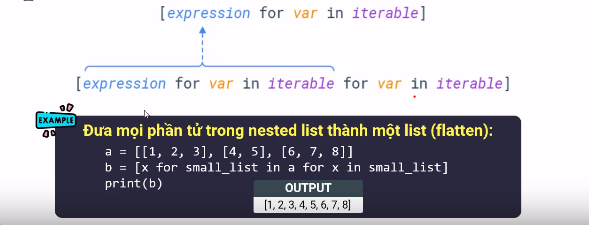

# BÀI 58: LIST COMPREHENSION

- Comprehension là một cách nhanh chóng để có thể tạo một cấu trúc dữ liệu từ iterable. Nó có thể kết hợp với điều kiện và vòng lặp để rút gọn cú pháp. List comprehension sẽ giúp code cỉa bạn Pythonic hơn.

## 1. Cú pháp và các ví dụ cơ bản.

- Cú pháp: `expression for var in iterable`.

    - `expression`: biểu thức được thực hiện mỗi khi vòng lặp thực thi.

    - `var`: một biến là một item trong iterable.

    - `iterable`: collections chứa các object(list, tuple, str,...).

- Ví dụ:

    ```python
    a = [1, 3, 4, 5, 6, 7]
    b = [x + 3 for x in a]
    print(b)
    ```

    ```python
    # ket qua
    [4, 6, 7, 8, 9, 10]
    ```

- Tạo một list từ range:

    ```python
    a = [x ** 3 for x in range(5)]
    print(a)
    ```

    ```python
    # ket qua
    [0, 1, 8, 27, 64]
    ```

- Tạo một list từ str:

    ```python
    s = '28tech'
    a = [x for x in s]
    print(a)
    ```

    ```python
    # ket qua
    ['2', '8', 't', 'e', 'c', 'h']
    ```

- Tạo một list trị tuyệt đối của các phần tử của một list đã có:

    ```python
    a = [1, -3, 4, -5, 6, 7]
    b = [abs(x) for x in a]
    print(b)
    ```

    ```python
    # ket qua
    [1, 3, 4, 5, 6, 7]
    ```

- Kết hợp hàm với list comprehension:

    ```python
    def digitSum(n):
        sum = 0
        while n != 0:
            sum += n % 10
            n //= 10
        return sum

    a = [123, 456, 789, 1234]
    b = [digitSum(x) for x in a]
    print(b)
    ```

    ```python
    # kêt quả
    [6, 15, 24, 10]
    ```

## 2. List comp với câu lệnh if:

- Khi bạn sử udngj list comprehension bạn có thể sử dụng mệnh đề if để lọc dữ liệu phù hợp.

- Cú pháp: `[expression for var interable if_clausel]`

- Ví dụ:

    ```python
    a = [1, 2, 3, -5, 3, -4, 0]
    b = [x for x in a if x >= 0]
    print(b)
    ```

    ```python
    [1, 2, 3, 4, 0]
    ``` 

## 3. Nested List comprehension

- Biểu thức bên trong list comp có thể là một list comp khác.

    

## 4. So sánh list comprehension với map + lambda

- Khi sử dụng các hàm có sẵn thì sử dụng máp sẽ nhanh gọn hơn so với listcomp.

    ```python
    # map
    s = '28tech'
    a = list(map(ord, s))
    print(a)
    # listcomp
    b = [ord(x) for x in s]
    print(b)
    ```

    ```python
    # ket qua
    [50, 56, 116, 101, 99, 104]
    [50, 56, 116, 101, 99, 104]
    ```

- Tuy nhiên khi apply một hàm khác các hàm có sắn thì sự kết hợp của listcomp với lambda sẽ ngắn gọn hơn so với sự kết hợp của lamda với map.

    ```python
    # listcomp
    a = range(5)
    b = [x ** 2 for x in a]
    print(a)
    # map
    c = list(map(lambda x: x ** 2, a))
    print(c)
    ```

## 5. So sánh list comprehension với filter.

- Lộc ra những số chẵn bằng listcomp và filter kết hợp với lambda.

    ```python
    a = range(10)
    # listcomp
    even = [x for x in a if x % 2 == 0]
    print(even)
    # map
    c = list(filter(lambda x: x % 2 == 0, a))
    print(c)
    ```

    ```python
    # ket qua
    [0, 2, 4, 6, 8]
    [0, 2, 4, 6, 8]
    ```